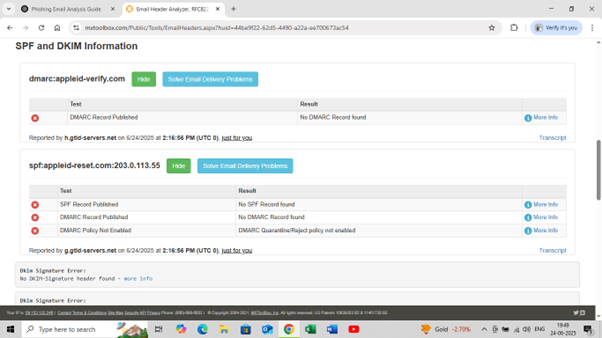
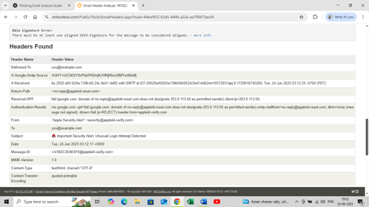
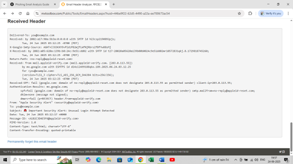

# Phishing Email Analysis Report

## 1.Sample Email Description

**Subject:** Important Security Alert: Unusual Login Attempt Detected  
**From:** security@appleid-verify.com  
**To:** you@example.com  
**Reply-To:** no-reply@appleid-reset.com  
**Date:** June 24, 2025  

**Email Summary:**  
The email claims that an unauthorized login to the user’s Apple ID occurred from Germany. The user is urged to verify their account through a suspicious link, or else face account suspension.

## 2.Indicators of Phishing

| Indicator | Observation |
|----------|-------------|
| **Suspicious Sender Domain** | `appleid-verify.com` is not a genuine Apple domain |
| **Reply-To Mismatch** | Email replies go to `appleid-reset.com`, not Apple |
| **Mismatched URL** | Hyperlink says "Verify Account Now" but leads to `http://appleid-verify-login.support/reset` |
| **Urgent Language** | Implies account will be suspended within 24 hours |
| **Generic Greeting** | “Dear Apple User” – no personalization |
| **Unusual Location & IP** | Login attempt supposedly from IP `185.34.111.202` in Frankfurt |
| **Polished Format** | Clean layout but fake identity |
| **SPF/DKIM/DMARC Failures** | Header shows all 3 authentication mechanisms fail |

## 3.Email Header Analysis (via MxToolbox)

**Tool Used:** [https://mxtoolbox.com/EmailHeaders.aspx](https://mxtoolbox.com/EmailHeaders.aspx)

### Results from the header:

Below is a summary of what MxToolbox revealed:

- **SPF:** ❌ Fail – `203.0.113.55` is not a permitted sender for `appleid-reset.com`
- **DKIM:** ❌ None – No digital signature from Apple
- **DMARC:** ❌ Fail – Domain does not protect itself from spoofing
- **Return-Path:** `no-reply@appleid-reset.com` (mismatched domain)
- **From:** `security@appleid-verify.com` (non-Apple domain)
- **Received From IP:** `203.0.113.55` – unrelated to Apple infrastructure

### 📷 Screenshots from MxToolbox

1. SPF, DKIM, DMARC Check  

2. Header Field Overview  

3. Received Header Trace  

## 4.Conclusion

This email is a **high-confidence phishing attempt**. It impersonates Apple using a lookalike domain, includes urgency, mismatched reply-to addresses, and fails all major email authentication checks. Users should **delete** the email and **report** it to their provider.

## 5.Tools Used

- MxToolbox Email Header Analyzer  
- Manual content review  
- URL inspection (hovering over links)  

## 6.Learning Outcome

- Understood how phishing emails spoof brands and domains  
- Practiced header analysis and link inspection  
- Identified social engineering tactics in real-world emails
